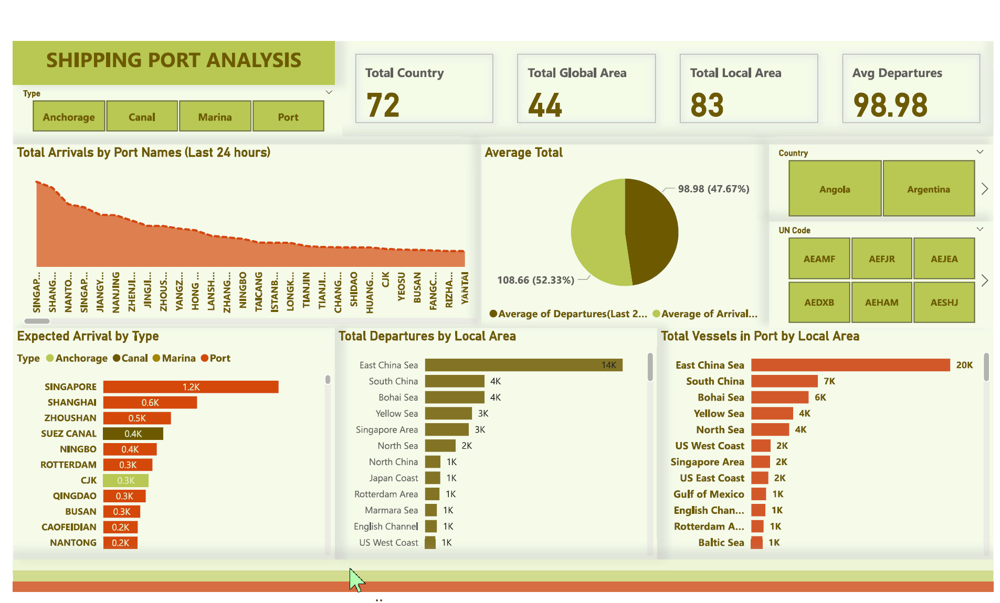

# 🚢 Shipping Port Analysis Dashboard

## 📘 Overview

The **Shipping Port Analysis Dashboard** provides a comprehensive view of global port activity across 72 countries and 83 local areas. It allows stakeholders and logistics analysts to monitor shipping traffic, vessel locations, and port performance in near real-time.

---

## 📊 Key Metrics

* **Total Countries Monitored**: 72
* **Global Areas Covered**: 44
* **Local Areas Tracked**: 83
* **Average Departures (Last 24 Hours)**: 98.98

---

## 🧩 Dashboard Components

### 📍 Total Arrivals by Port (Last 24 Hours)

* Displays arrival activity across global ports.
* **Top Active Port**: Singapore

### 🚢 Expected Arrival by Type

* Categorizes incoming vessel activity by:

  * **Anchorage**
  * **Canal**
  * **Marina**
  * **Port**
* Singapore leads with 1.2K expected arrivals.

### 🌎 Total Departures by Local Area

* Highlights vessel departures by regions like:

  * East China Sea (14K)
  * South China (4K)
  * Bohai Sea (4K)

### ⛴️ Total Vessels in Port by Local Area

* Tracks live vessel counts in major waters:

  * East China Sea (20K)
  * South China (7K)
  * Bohai Sea (6K)

### 🍰 Average Total Analysis

* Pie chart compares:

  * **Average Departures (47.67%)**
  * **Average Arrivals (52.33%)**

### 🗺️ Country & UN Code Filters

* Filter port metrics by specific countries or UN location codes (e.g., AEAMF, AESHJ, etc.)

---

## 🔍 Use Cases

* **Port Traffic Monitoring**: Track real-time vessel activity and port congestion.
* **Logistics Planning**: Forecast delays and optimize shipping schedules.
* **Geopolitical Risk Assessment**: Monitor activity changes in strategic regions (e.g., Suez Canal).
* **Maritime Operations**: Useful for shipping companies, freight forwarders, and coast guard planning.

---

## 🛠️ Built With

* **Power BI** for dashboard interactivity and visuals
* **Port/Vessel Movement Data** from real-time maritime sources (assumed)

---
